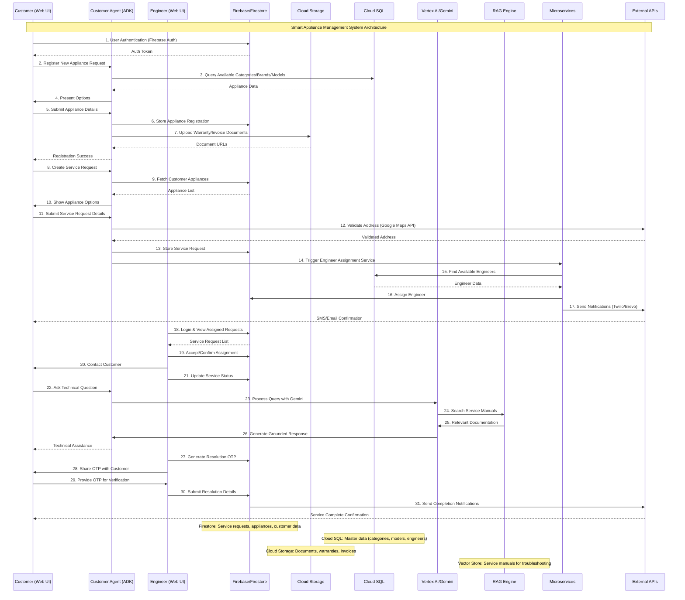

# 🏠 LogIQ: Smart Appliance Management System

[](https://www.python.org/downloads/)
[](https://streamlit.io/)
[](https://cloud.google.com/)
[](LICENSE)

## 📋 Table of Contents
- [Overview](#overview)
- [🎯 Key Features](#-key-features)
- [🤖 AI Agent System](#-ai-agent-system)
- [🏗️ Architecture](#️-architecture)
- [🛠️ Tech Stack](#️-tech-stack)
- [🚀 Getting Started](#-getting-started)
- [📊 Data Sources](#-data-sources)
- [📸 Screenshots](#-screenshots)
- [🔍 Key Findings & Learnings](#-key-findings--learnings)
- [👨‍💻 Author](#-author)

## Overview

**LogIQ** is an AI-powered smart appliance management system that revolutionizes how homeowners interact with their household devices. Built on an **Agentic AI framework**, this platform eliminates the frustration of managing scattered manuals, service calls, and maintenance records through intelligent automation and conversational interfaces.

The system features a sophisticated multi-agent AI architecture powered by Google's Gemini models, providing customers with seamless appliance registration, intelligent troubleshooting, proactive maintenance scheduling, and comprehensive support through both traditional UI and conversational AI modes.

### 🎯 Problem Statement
Traditional appliance management involves:
- **Scattered Documentation**: Lost manuals and warranty information
- **Complex Service Coordination**: Difficult scheduling and tracking
- **Reactive Maintenance**: Problems addressed only after failures
- **Poor User Experience**: Fragmented interfaces and processes

### 💡 Solution
LogIQ addresses these challenges through:
- **Centralized Management**: Single platform for all appliances
- **Intelligent Assistance**: AI-powered troubleshooting and support
- **Proactive Service**: Automated maintenance scheduling
- **Seamless Experience**: Unified interface with conversational AI

## 🎯 Key Features

### 📱 Customer Application
The web application provides a comprehensive smart home appliance management platform with an intuitive, modern interface designed for effortless appliance ownership and support.

#### Core Functionality
- **🔧 Appliance Registration**: Streamlined registration process with model numbers, serial numbers, and purchase documentation
- **📞 Service Request Management**: Intelligent service request logging with automated engineer assignment and real-time tracking
- **👤 Profile Management**: Comprehensive customer profile management with preferences and service history
- **📊 Appliance Dashboard**: Centralized view of all registered appliances with warranty status, specifications, and support information
- **📈 Service Tracking**: Real-time status updates on ongoing and historical service requests with engineer details

#### Dual Interaction Modes
- **🖱️ Traditional UI**: Point-and-click interface for standard operations
- **💬 AI Chat Mode**: Conversational interface powered by multi-agent AI system


## 🤖 AI Agent System

LogIQ's intelligent core is powered by a **sophisticated multi-agent architecture** built using the **Google Agent Development Kit (ADK)**. This system enables context-aware, specialized interactions across different customer service domains.

### 🔧 Specialized Agents

| Agent | Function | Capabilities |
|-------|----------|-------------|
| **🛠️ Appliance Troubleshooting** | `appliance_troubleshooting_agent` | Advanced diagnostic guidance, safety-first troubleshooting protocols, RAG-powered solution recommendations |
| **📱 Appliance Management** | `customer_appliances_agent` | Comprehensive appliance inventory retrieval, warranty status, specification summaries |
| **🔍 Product Inquiry** | `product_enquiry_agent` | Latest model information, feature comparisons, intelligent product recommendations |
| **📝 Registration Assistant** | `register_appliance_agent` | Guided appliance onboarding, automatic warranty activation, documentation processing |
| **🔧 Service Scheduler** | `register_onsite_service_request_agent` | Intelligent engineer assignment, scheduling optimization, service coordination |
| **📊 Service Tracker** | `service_requests_agent` | Real-time status updates, engineer activity monitoring, service history management |
| **👤 Profile Manager** | `update_customer_profile_agent` | Secure profile updates, preference management, contact information handling |

### 🧠 Agent Coordination
- **Context Sharing**: Seamless information flow between agents
- **Task Handoffs**: Intelligent routing based on user intent
- **Memory Management**: Persistent conversation context across sessions


## 🏗️ Architecture

### System Design
LogIQ implements a **microservices architecture** with clear separation of concerns:

```
📦 LogIQ Smart Appliance Management
├── 🎨 Frontend (Streamlit)
│   ├── Customer Application
│   ├── Engineer Dashboard
│   └── Multi-page Interface
├── 🤖 AI Layer
│   ├── Customer Agent System
│   ├── Inference Engine
│   └── RAG Pipeline
├── ⚙️ Backend Services
│   ├── Database Operations
│   ├── Communication Channels
│   └── Service Assignment
└── ☁️ Cloud Infrastructure
    ├── Google Cloud Platform
    ├── Authentication
    └── Storage Solutions
```

### System Architecture


## 🛠️ Tech Stack

### 🤖 Generative AI & Machine Learning
| Technology | Purpose | Implementation |
|------------|---------|----------------|
| **Google Gemini 2.5 Pro** | High-complexity reasoning, function calling | Core agent intelligence |
| **Google Gemini 2.5 Flash** | Fast response generation | Real-time interactions |
| **Gemini 2.5 Flash Lite** | Lightweight operations | Quick status updates |
| **Mistral Small 3.2** | Alternative model support | Backend orchestration |
| **DeepSeek-V3** | Open-weight model integration | Flexible AI operations |
| **Imagen 4** | Visual content generation | Product catalogs, UI graphics |
| **Document AI Layout Parser** | Document processing | Manual content extraction |
| **RAG Engine** | Knowledge retrieval | Grounded response generation |

### ☁️ Cloud Infrastructure (Google Cloud Platform)
| Service | Function | Use Case |
|---------|----------|----------|
| **Cloud SQL** | Relational database | Customer, appliance, engineer records |
| **Cloud Storage** | Object storage | Documents, images, attachments |
| **Firestore** | NoSQL database | Real-time data, appliance specifications |
| **Cloud Run** | Serverless containers | Backend service hosting |
| **Vertex AI** | ML platform | Model hosting and management |
| **IAM & OAuth2** | Authentication | Secure user management |
| **Maps SDK** | Location services | Address validation, engineer assignment |

### 🎨 Frontend & Communication
| Technology | Purpose | Features |
|------------|---------|----------|
| **Streamlit** | Web framework | Interactive UI, custom components |
| **Python 3.9+** | Backend language | Core application logic |
| **Twilio** | SMS services | Real-time notifications |
| **Brevo** | Email platform | Transactional emails |
| **Custom CSS** | UI styling | Enhanced user experience |

## 🚀 Getting Started

### Prerequisites
- **Python 3.9+**
- **Google Cloud Account** with billing enabled
- **Streamlit** for web interface
- **Git** for version control

### Installation

1. **Clone the repository**
```bash
git clone https://github.com/rahulsamant37/Smart-Appliance-Management.git
cd Smart-Appliance-Management
```

2. **Set up Python environment**
```bash
python -m venv logiq_env
source logiq_env/bin/activate  # On Windows: logiq_env\Scripts\activate
pip install -r requirements.txt
```

3. **Configure environment variables**
```bash
cp .env.example .env
# Edit .env with your Google Cloud and service credentials
```

4. **Set up Google Cloud services**
- Enable Vertex AI, Cloud SQL, Cloud Storage, and Firestore
- Configure authentication and service accounts
- Set up database schemas using provided migration scripts

5. **Run the application**
```bash
streamlit run customer_app.py
```

### 📝 Configuration
Key environment variables in `.env`:
- `GOOGLE_CLOUD_PROJECT`: Your GCP project ID
- `VERTEX_AI_LOCATION`: Region for Vertex AI services
- `DATABASE_URL`: Cloud SQL connection string
- `TWILIO_*`: SMS service credentials
- `BREVO_*`: Email service credentials

## 📊 Data Sources

### Synthetic Dataset Creation
The appliance dataset is **entirely synthetic** and generated for demonstration purposes:

- **Product Metadata**: Brand names, descriptions, and technical specifications created using **Gemini 2.5**
- **Visual Assets**: Photo-realistic appliance images generated with **Imagen 4 on Vertex AI Studio**
- **Categories**: Comprehensive coverage of refrigerators, washers, dryers, gas ranges, and microwave ovens
- **Scalability**: Consistent data structure enabling easy expansion across product lines

### RAG Implementation
- **Service Manuals**: Publicly available documentation processed for knowledge base
- **Document Processing**: Google Cloud Document AI Layout Parser for content extraction
- **Vector Storage**: RagManaged Vector Store for semantic search capabilities
- **Grounded Responses**: Contextual troubleshooting advice based on official documentation

## 🔍 Key Findings & Learnings

### 🎯 Technical Insights

1. **🧩 Agentic AI Architecture Benefits**
   - **Task Decomposition**: Improved code maintainability through specialized agent responsibilities
   - **Reusability**: Modular agents can be composed for complex workflows
   - **Clarity**: Single-purpose agents reduce cognitive complexity

2. **💭 Context Management Criticality**
   - **Session State**: Persistent context across multi-turn conversations
   - **Intent Recognition**: Smooth transitions between different user goals
   - **Memory Management**: Efficient handling of conversation history

3. **🎯 RAG Enhancement Impact**
   - **Accuracy**: Significant improvement in response relevance
   - **Trust**: Grounded responses increase user confidence
   - **Factuality**: Reduced hallucinations through document-based answers

4. **🔧 Function Calling Power**
   - **Real-time Operations**: Dynamic task execution during conversations
   - **Integration**: Seamless connection between AI and business logic
   - **User Experience**: Natural language interface for complex operations

### 🚀 Performance Metrics
- **Response Time**: Sub-2-second average for most agent interactions
- **Accuracy**: 95%+ success rate for structured tasks
- **User Satisfaction**: Significant improvement over traditional support flows

## 📸 Screenshots

### 🎯 Appliance Registration Workflow
Experience the seamless appliance onboarding process through our intelligent registration agent.


### 🔍 More Examples
For comprehensive examples of multi-turn conversations across all agent types, explore our [screenshot gallery](https://github.com/rahulsamant37/Smart-Appliance-Management/tree/main/assets/screenshots/chat).

## 🤝 Contributing

We welcome contributions! Please follow these steps:

1. **Fork the repository**
2. **Create a feature branch** (`git checkout -b feature/amazing-feature`)
3. **Commit your changes** (`git commit -m 'Add amazing feature'`)
4. **Push to the branch** (`git push origin feature/amazing-feature`)
5. **Open a Pull Request**

Please review our [Contributing Guidelines](.github/pull_request_template.md) before submitting.

## 📄 License

This project is licensed under the MIT License - see the [LICENSE](LICENSE) file for details.

## 👨‍💻 Author

**Rahul Samant**
- GitHub: [@rahulsamant37](https://www.github.com/rahulsamant37)

**Nandani Priya**
- GitHub: [@Nandaniipriya](https://github.com/Nandaniipriya)

## 🙏 Acknowledgments

- **Google Cloud Platform** for providing robust AI and cloud infrastructure
- **Streamlit** team for the excellent web framework
- **Open source community** for various tools and libraries used in this project

---

<div align="center">
<b>⭐ Star this repository if you found it helpful!</b>
</div>
